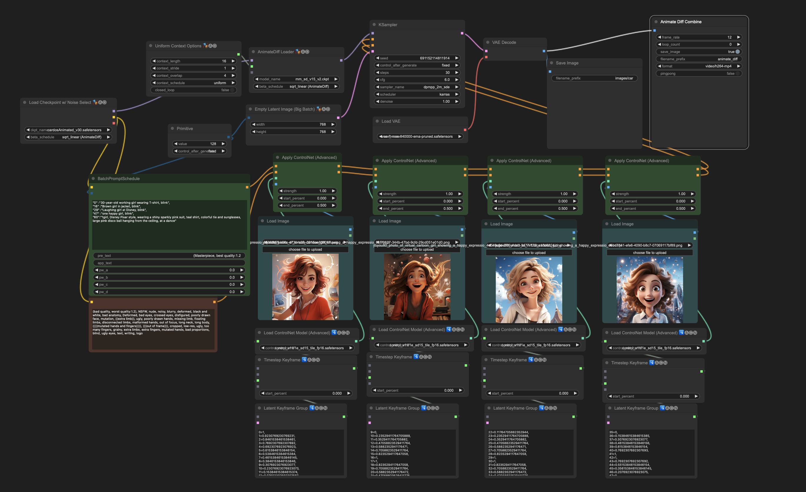

# ComfyUI Workflows 集合

## 简介

ComfyUI是一个基于stablediffusion的webui，让用户可以通过编辑工作流的方式定制AI图片生成的功能模块。在这个开源项目中，我们集合了各种有趣且实用的workflow，供大家参考和学习。

## 如何使用

1. 浏览`workflows`文件夹，选择你感兴趣的workflow。
2. 在每个workflow的子文件夹中，你会找到：
   - `config.json`: workflow的配置文件。
   - `screenshot.png`: workflow内容的截图。
   - `description.md`: 该workflow的详细操作说明。

## 示例

### AnimateDiff多图引导 / Multi img2vid

[查看详情和操作说明](./workflows/multi-img2vid/description.md)

### AnimateDiff + IP-Adapter 长视频风格迁移 / Long video create using IP-Adapter

... （更多示例）

## 贡献

欢迎提交Pull Request或提出建议和改进！确保在提交新的workflow时，遵循上述的文件结构。

## 许可证

[MIT License](LICENSE)

